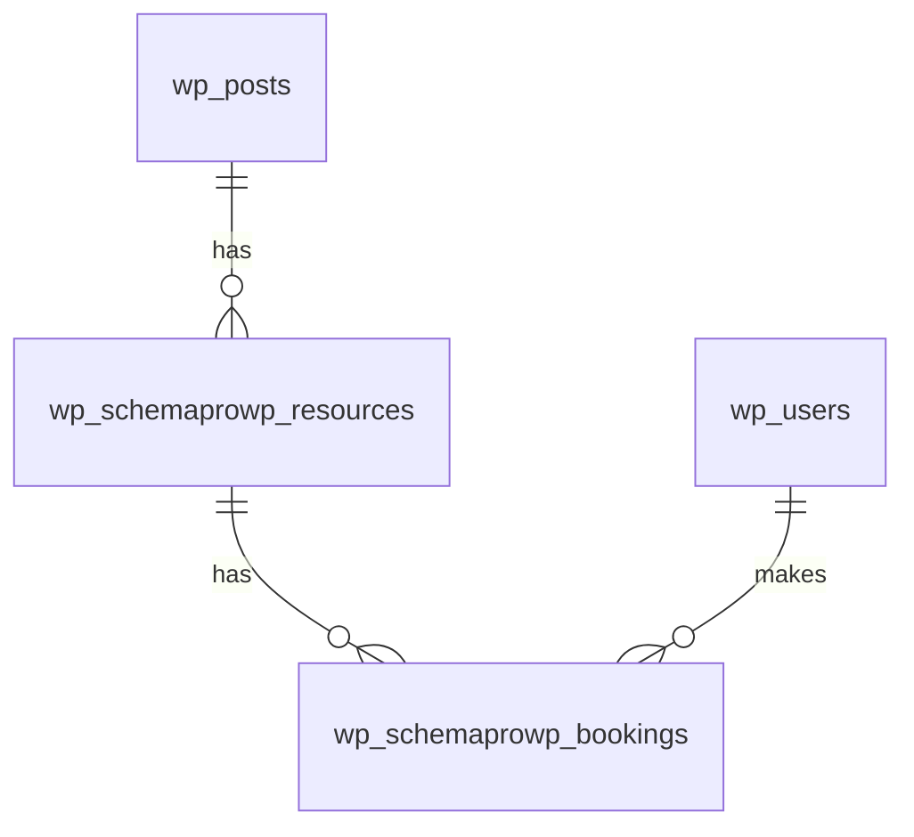

# SchemaProWP Databasstruktur

Detta dokument beskriver databasstrukturen för SchemaProWP-pluginet.

## WordPress Core-tabeller

### wp_posts
Används för att lagra organisationer som custom post type.

- **Post Type**: `schemaprowp_organization`
- **Metadata**: Lagras i `wp_postmeta`

### wp_users
Används för användarhantering.

### wp_usermeta
Används för att lagra användarspecifik metadata.

## Custom-tabeller

### wp_schemaprowp_resources
Tabell för resurshantering.

```sql
CREATE TABLE wp_schemaprowp_resources (
    id bigint(20) unsigned NOT NULL AUTO_INCREMENT,
    post_id bigint(20) unsigned NOT NULL,
    name varchar(255) NOT NULL,
    type varchar(50) NOT NULL,
    status varchar(20) NOT NULL DEFAULT 'active',
    properties longtext DEFAULT NULL,
    created_at datetime NOT NULL,
    updated_at datetime NOT NULL,
    PRIMARY KEY (id),
    KEY post_id (post_id),
    KEY type (type),
    KEY status (status)
) ENGINE=InnoDB DEFAULT CHARSET=utf8mb4 COLLATE=utf8mb4_unicode_ci;
```

#### Kolumnbeskrivningar:
- `id`: Unikt ID för resursen
- `post_id`: ID för organisationen (wp_posts)
- `name`: Resursens namn
- `type`: Resurstyp (t.ex. "room", "equipment", "vehicle")
- `status`: Resursstatus ("active" eller "inactive")
- `properties`: JSON-objekt med resursspecifika egenskaper
- `created_at`: Tidsstämpel för när resursen skapades
- `updated_at`: Tidsstämpel för senaste uppdateringen

### wp_schemaprowp_bookings
Tabell för bokningshantering.

```sql
CREATE TABLE wp_schemaprowp_bookings (
    id bigint(20) unsigned NOT NULL AUTO_INCREMENT,
    resource_id bigint(20) unsigned NOT NULL,
    user_id bigint(20) unsigned NOT NULL,
    start_time datetime NOT NULL,
    end_time datetime NOT NULL,
    status varchar(20) NOT NULL DEFAULT 'pending',
    comments text DEFAULT NULL,
    created_at datetime NOT NULL,
    updated_at datetime NOT NULL,
    PRIMARY KEY (id),
    KEY resource_id (resource_id),
    KEY user_id (user_id),
    KEY status (status),
    KEY time_range (start_time, end_time)
) ENGINE=InnoDB DEFAULT CHARSET=utf8mb4 COLLATE=utf8mb4_unicode_ci;
```

#### Kolumnbeskrivningar:
- `id`: Unikt ID för bokningen
- `resource_id`: ID för den bokade resursen
- `user_id`: ID för användaren som gjorde bokningen
- `start_time`: Bokningens starttid
- `end_time`: Bokningens sluttid
- `status`: Bokningsstatus ("pending", "confirmed", "cancelled")
- `comments`: Valfria kommentarer för bokningen
- `created_at`: Tidsstämpel för när bokningen skapades
- `updated_at`: Tidsstämpel för senaste uppdateringen

## Datarelationer



### Relationsförklaringar:
1. En organisation (wp_posts) kan ha flera resurser
2. En resurs kan ha flera bokningar
3. En användare kan ha flera bokningar
4. En bokning tillhör exakt en resurs och en användare

## Indexering och Prestanda

### wp_schemaprowp_resources
- Primärnyckel på `id`
- Index på `post_id` för snabb filtrering per organisation
- Index på `type` för filtrering per resurstyp
- Index på `status` för filtrering på status

### wp_schemaprowp_bookings
- Primärnyckel på `id`
- Index på `resource_id` för snabb filtrering per resurs
- Index på `user_id` för filtrering per användare
- Index på `status` för filtrering på bokningsstatus
- Sammansatt index på `start_time, end_time` för effektiv tidssökning

## Datavalidering

### Resurser
- `name`: Måste vara ifyllt, max 255 tecken
- `type`: Måste vara en giltig resurstyp
- `status`: Måste vara antingen "active" eller "inactive"
- `properties`: Måste vara giltig JSON

### Bokningar
- `start_time`: Måste vara ett giltigt datum/tid
- `end_time`: Måste vara efter start_time
- `status`: Måste vara "pending", "confirmed" eller "cancelled"
- Får inte överlappa med andra bokningar för samma resurs

## Uppgradering och Migrering

Vid uppgradering av pluginet:
1. Nya tabeller skapas om de inte finns
2. Befintliga tabeller uppdateras vid behov
3. Data migreras om nödvändigt
4. Index uppdateras

Se `class-schema-pro-wp-activator.php` för implementationsdetaljer.
